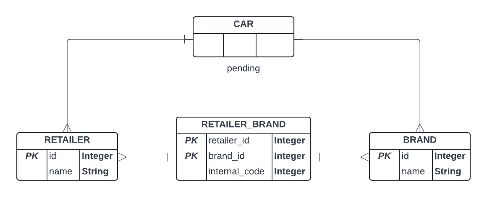

# Database Schema

This document explains the structure of the Entity Relationship model used in the project, which define the 
relationships between retailers, brands, and cars.

## Entity Relationship Model

The database schema consists of four main tables:

1. **RETAILER Table**  
2. **BRAND Table**  
3. **RETAILER_BRAND Table**  
4. **CAR Table (Products)**  

### 1. Retailer Table

The `RETAILER` table stores information about retailers. It has the following columns:
- `id`: a unique identifier for each retailer (Primary Key, Auto Increment).
- `name`: the name of the retailer.

### 2. Brand Table

The `BRAND` table stores information about product brands. It includes:
- `id`: A unique identifier for each brand (Primary Key, Auto Increment).
- `name`: The name of the brand.

### 3. Retailer_Brand Table

The `RETAILER_BRAND` table is used to store retailer-specific internal codes for brands. This table establishes a 
many-to-many relationship between the `RETAILER` and `BRAND` tables. It has:
- `retailer_id`: The ID of the retailer (Foreign Key referencing `RETAILER(id)`).
- `brand_id`: The ID of the brand (Foreign Key referencing `BRAND(id)`).
- `internal_code`: A unique internal code assigned by the retailer for the brand.

The combination of `retailer_id` and `brand_id` forms the Primary Key, ensuring that each retailer-brand pair is unique.

### 4. Car Table

The `CAR` table represents products that belong to specific retailers and brands. Each product has:

TO BE DONE

---
